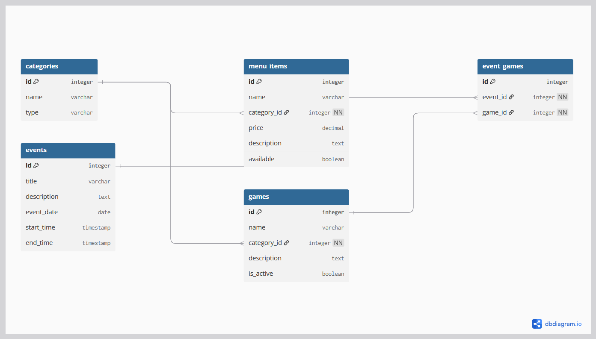
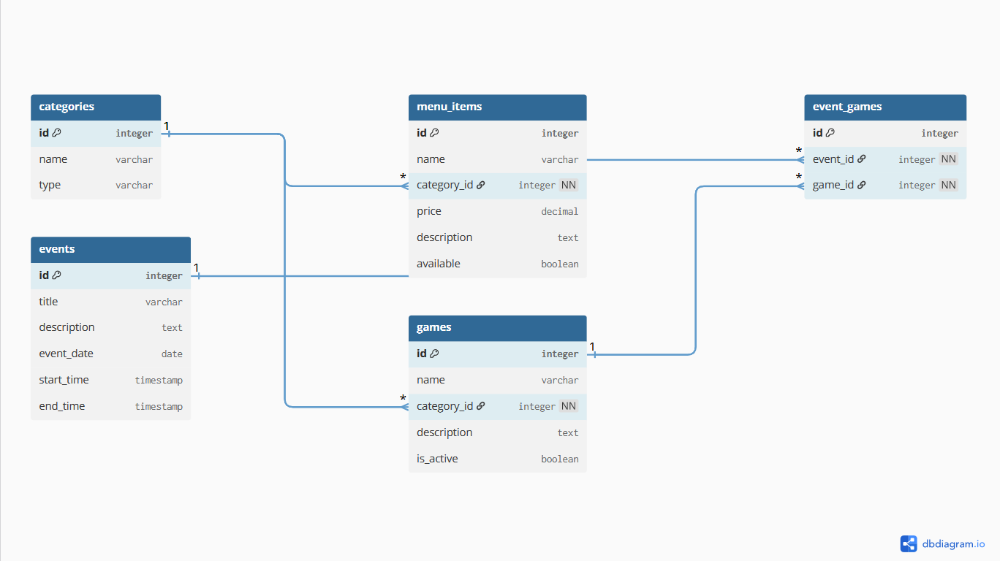

# Entity Relationship Diagram

Reference the Creating an Entity Relationship Diagram final project guide in the course portal for more information about how to complete this deliverable.

## Create the List of Tables

The tables included in our entity relationship diagram are:

- categories
- events
- menu_items
- games
- event_games

## Add the Entity Relationship Diagram

Below is the entity relationship diagram for our app.

 

